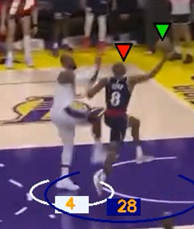

# basket_analysis

A short video <10 seconds is provided as input. Using openCV and Deep Learning models we are able to detect and track the ball, and the players belonging to the different teams. Player team assignment is done using Fashion-CLIP.   The output video looks like this: 

  
   

  The video is then fed to Qwen3-VL-4B that outputs a description of the entire video chronologically. The obtained description is then refined by a LLm, in our case it's Qwen3-4B-Instruct that provides an engaging "spoken commentary". The last step consist of using the refined description by passing it to Zonos, a Text-to-Speech model from the Coqui-TTS framework. 
